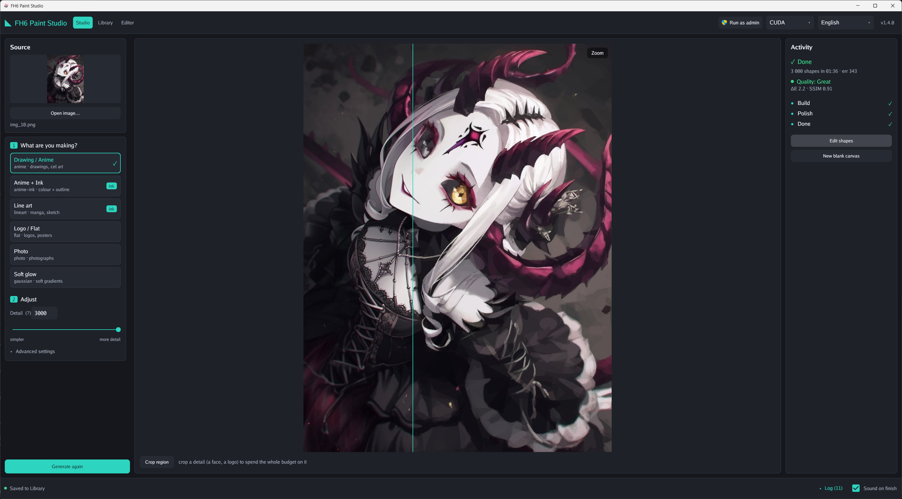
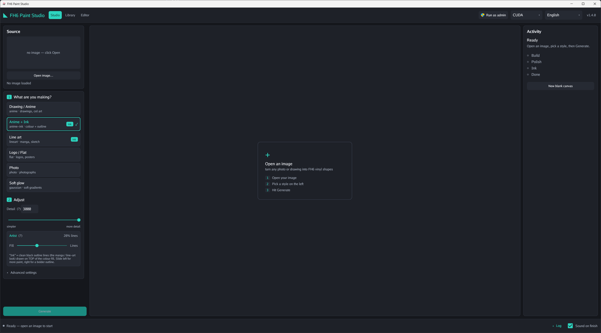
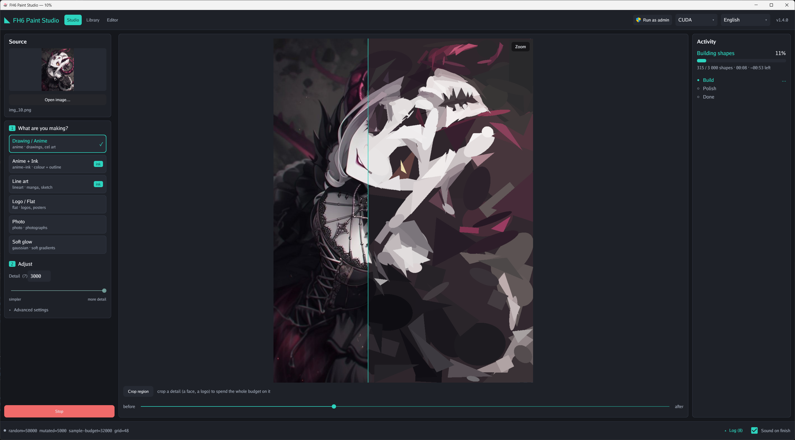
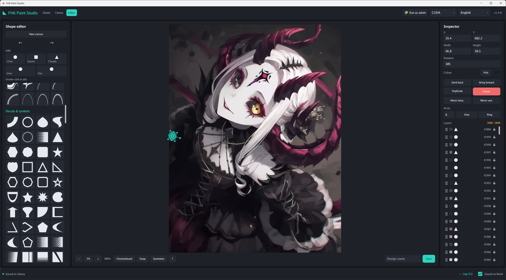
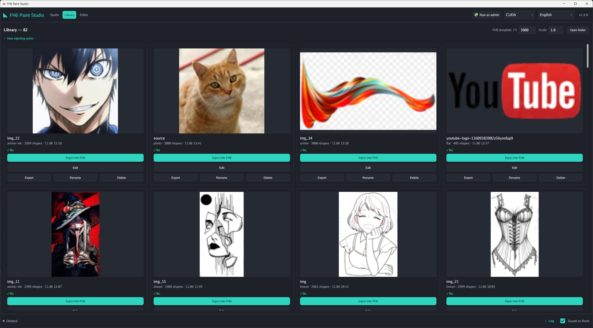
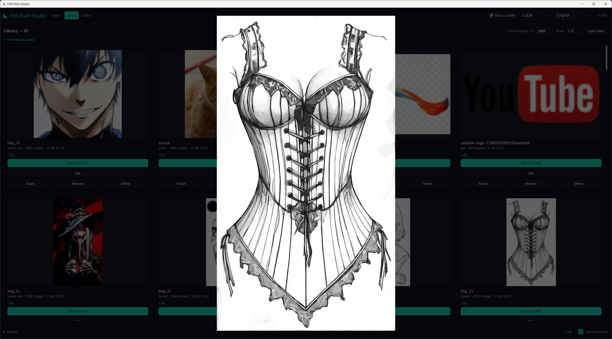

# FH6 Paint Studio

Turn any image into a **Forza Horizon vinyl livery**. FH6 Paint Studio rebuilds your photo or artwork
out of a few thousand simple coloured shapes - exactly the "layers" the in-game Vinyl Group Editor
stacks - and injects the finished result straight into the game. You never place a single shape by hand.

**[Download the latest release](https://github.com/HorizonRepublic/fh6-paint-studio/releases)**



See it end to end: [source photo](assets/cat/source.jpg) → [generated reconstruction](assets/cat/generated.jpg) → [on the car in-game](assets/cat/car.jpg).

> **Requirements:** Windows + a GPU - **NVIDIA** (GTX 10-series or newer) or any modern **AMD / Intel**.
> The app picks the backend for you, or you choose it. A GPU is required - there is no CPU fallback.

---

## What you get

- **Almost any image works** - photos, logos, anime screenshots, memes, your cat. It figures out the shapes.
- **GPU-accelerated** on NVIDIA and AMD/Intel, so a livery takes seconds, with a live preview that matches what you get in-game.
- **Presets per art style** - Photo, Anime, and Flat for clean logos - plus a line-art mode that traces outlines, an ink-over-fill hybrid, and a one-colour mode for single-colour decals that avoids muddy grey edges.
- **Built-in editor** - tweak a result by hand before injecting: move, scale, rotate and recolour shapes on a canvas, lock the layers you like, duplicate in rows or rings, snap into line, with full undo/redo. Or build a livery from scratch.
- **Crop to what matters** - box a region (e.g. a face) and spend the whole shape budget on the detail you care about.
- **Library** - every generation is saved, ready to re-inject or re-export later without regenerating.

---

## How to use it

### 1. Get the app
[**Download the latest release**](https://github.com/HorizonRepublic/fh6-paint-studio/releases/latest/download/fh6-paint-studio-windows-x64.7z)
and extract it. You get one folder - keep everything in it together and run **`fh6_paint_studio.exe`**
from inside. There's no installer.

It's a `.7z` archive: Windows 11 extracts it as-is, Windows 10 needs
[7-Zip](https://www.7-zip.org/) or WinRAR.

That link always points at the newest build. Every release also carries a version-stamped copy of the
same archive if you want to pin one.

### 2. Make a livery
1. **Open any image** you like - a photo, a logo, some art, whatever caught your eye.
   - The defaults are tuned to look good, so you can just leave everything as-is. Tweak the **preset**
     (anime / photo / flat) or the **shape budget** only if you want to.
   - For the cleanest result, use an image with a **transparent background**. A normal (opaque)
     background works too - the engine will just spend some shapes filling the background instead of
     your subject.
2. *(Optional)* **Crop** - drag a box over a region (e.g. a face) to spend the whole shape budget on
   the detail you care about.
3. Click **Generate** and wait for it to finish.
4. Your result is auto-saved to the **Library** tab.
5. *(Optional)* **Touch it up in the editor** - open the result to nudge shapes, fix a colour, or lock
   the parts you're happy with. The generated result is ready to inject as-is, so skip this if you
   don't need it.

### 3. Put it on your car (in Forza Horizon)
6. In the game's **Vinyl Group Editor**, create a group containing **N shapes** - where N is **at least
   as many shapes as your generation has** (more is fine). They can be any shapes; they're just
   placeholders the app overwrites. *Tip:* build a placeholder template once, save it, then re-import
   it and hit **Ungroup** whenever you need a fresh canvas.
7. Back in **FH6 Paint Studio → Library**, set the **FH6 layers** count, then click **Inject into FH6**.
   - No administrator rights needed, and the app never asks for any: the game is an ordinary
     process owned by you, which Windows lets you write to. If the injection is refused, you are
     almost certainly on the Microsoft Store / Game Pass build, which runs sandboxed - the Steam
     build works.
8. **Save the vinyl in-game - this step is required.** Right after injecting it may look rough or
   incomplete: the editor doesn't redraw every shape until the vinyl is **saved and reloaded**. Save
   it, reopen it, and it renders correctly - then apply it to your car.

### Shape budgets
Forza gives you **1000 shapes per bumper** and **3000 for every other panel** (side, roof, hood,
doors…). Match your budget to the panel you're decorating.

> Injection writes into a running game process and may violate the game's terms of service / be
> flagged by anti-cheat. It's for personal, offline use - **use it at your own risk.** Generating and
> exporting never touch the game.

---

## Is it safe? Verify your download

Every release is built by GitHub Actions and carries a **Sigstore build-provenance attestation** - a
signed, public record that ties the exact files you download to the commit and workflow that produced
them. You don't have to take my word that the binaries match the source; you can check it yourself with
the [GitHub CLI](https://cli.github.com/):

```sh
gh attestation verify fh6-paint-studio-<version>-windows-x64.7z --repo HorizonRepublic/fh6-paint-studio
```

A `SHA256SUMS` file ships with each release if you'd rather just confirm the download isn't corrupted.

**Heads-up on antivirus:** some scanners flag the app. Putting a livery on your car works by writing
into Forza's memory - the same technique cheats use - so heuristic scanners treat it as suspicious even
though it isn't. The code here is open and the build is attested, so you can confirm the binary is
exactly what's in this repo.

## Roadmap

- **Bulk processing** - reconstruct a whole folder of images in one run.

## Screenshots

<table>
  <tr>
    <td align="center"><br><sub><b>Main screen</b> - open an image, pick a preset, set the budget</sub></td>
    <td align="center"><br><sub><b>Reconstruction</b> - shapes layered in live</sub></td>
  </tr>
  <tr>
    <td align="center"><br><sub><b>Finished result</b></sub></td>
    <td align="center"><br><sub><b>Built-in editor</b> - tweak shapes by hand</sub></td>
  </tr>
  <tr>
    <td align="center"><br><sub><b>Library</b> - re-inject or re-export anytime</sub></td>
    <td align="center"><br><sub><b>Line-art mode</b> - traced outlines</sub></td>
  </tr>
</table>

## Build from source

Needs [Go 1.26+](https://go.dev/dl/). `.\scripts\build.ps1 -Cuda` builds the app against the CUDA
backend, `.\scripts\build-vulkan.ps1` against the cross-vendor Vulkan one, and
`.\scripts\build-allgpu.ps1` produces the unified binary that picks either at runtime. First-time
Windows toolchain setup (Go + CUDA + MSVC) is in `scripts\setup-windows.ps1`. Run the tests with
`go test -tags cuda ./...`.

## License

MIT - see [LICENSE](LICENSE). © 2026 Horizon Republic.

"Forza Horizon" is a trademark of Microsoft; this is an independent, unaffiliated tool.
