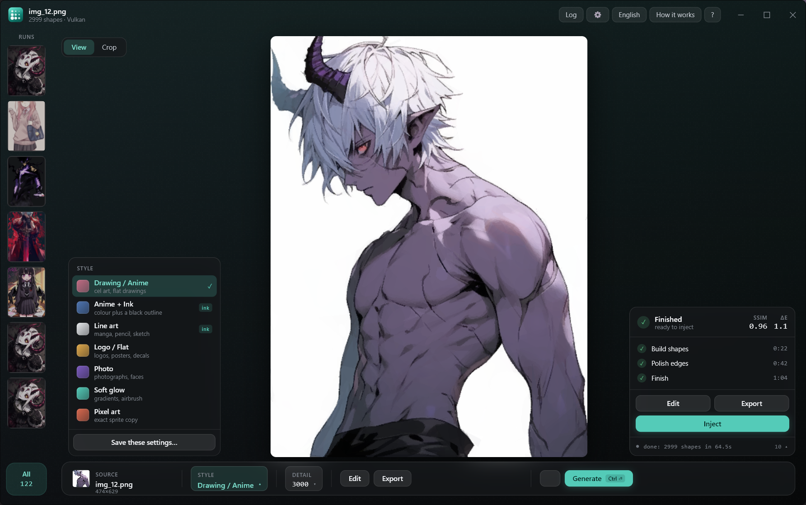
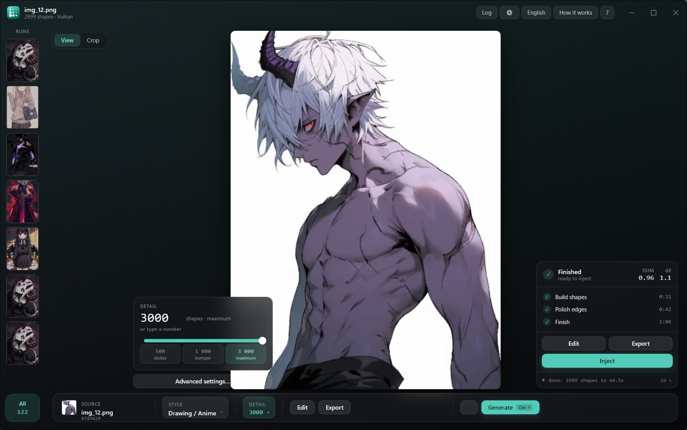
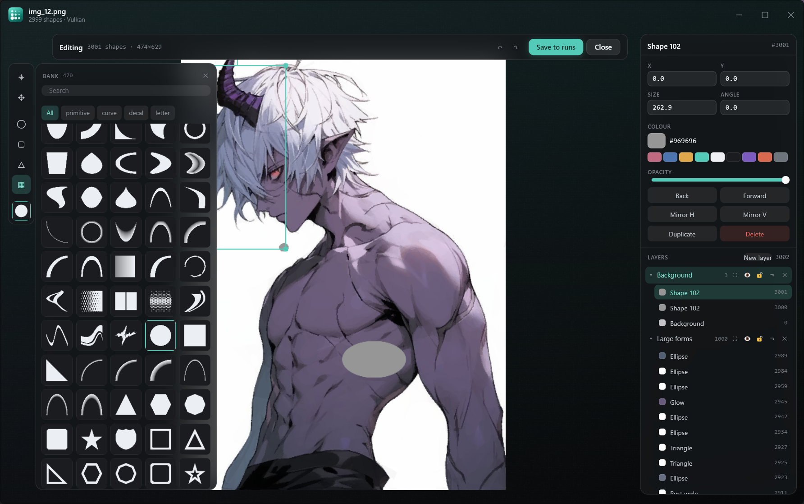
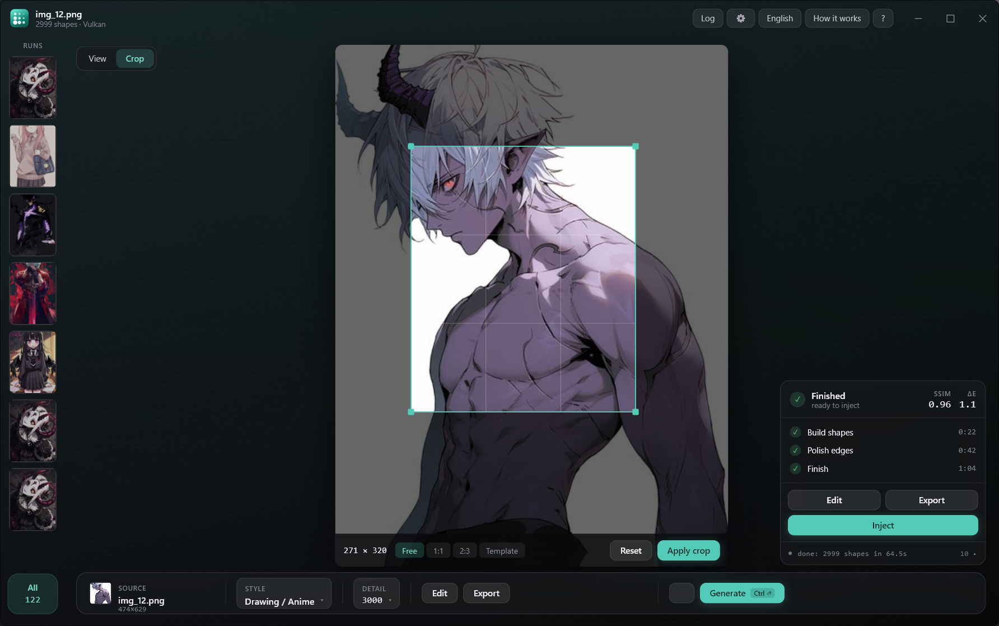
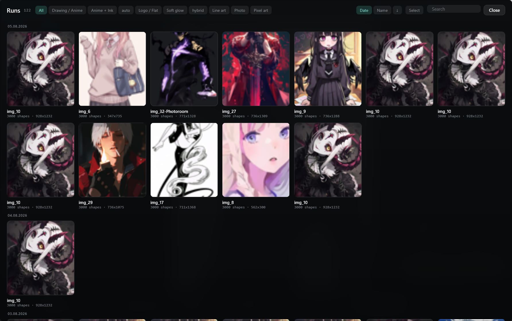
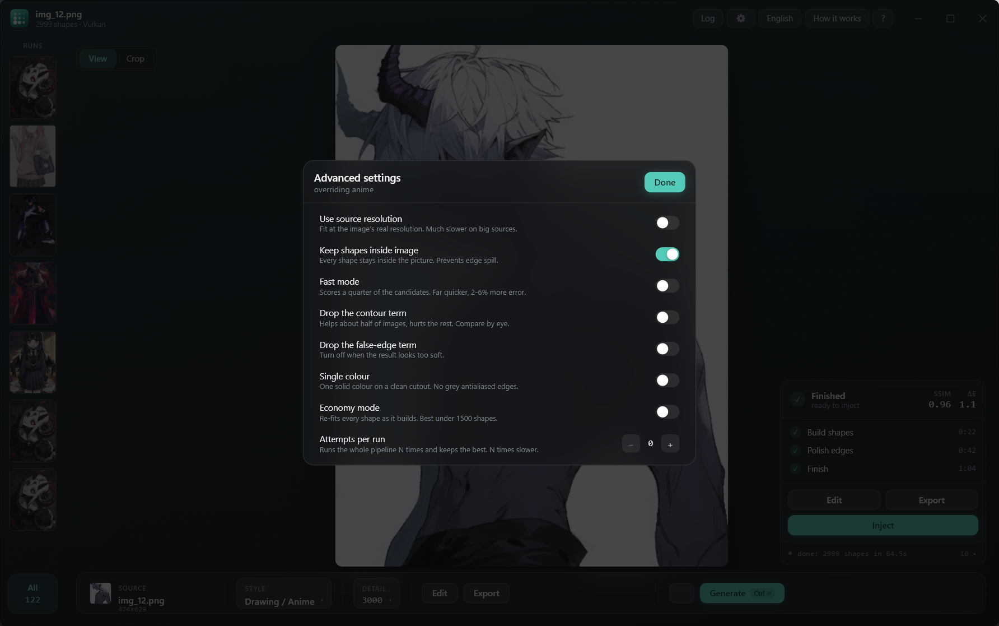

# FH6 Paint Studio

Turn any image into a **Forza Horizon vinyl livery**. FH6 Paint Studio rebuilds
a photo or artwork from a few thousand coloured shapes, the same layers the
in-game Vinyl Group Editor stacks. The finished result goes straight into the
game: you place nothing by hand unless you open the editor and choose to.

**[Download the latest release](https://github.com/HorizonRepublic/fh6-paint-studio/releases)**


End to end: [source photo](assets/cat/source.jpg) →
[reconstruction](assets/cat/generated.jpg) → [on the car](assets/cat/car.jpg).

> **Requirements:** Windows and a GPU with Vulkan support, which covers recent
> NVIDIA, AMD and Intel cards alike. The engine has no CPU fallback.

---

## What you get

- **Almost any image works**: photos, logos, anime screenshots, memes, your cat.
- **Fast**: the reconstruction runs on the GPU, and the live preview matches
  what the game will draw.
- **A preset per art style**: Photo, Drawing/Anime, and Logo/Flat, plus line art
  that traces outlines, an ink-over-fill hybrid, a soft-glow mode for gradients,
  pixel art, and a one-colour mode for clean single-colour decals.
- **A real editor**: drag, scale, rotate and recolour shapes on the canvas, with
  full undo. Select a group and move it together, pick any colour, zoom with
  Ctrl+wheel, and place new shapes from the bank of 470 in-game primitives and
  decals. Lock or hide whole layers.
- **Crop to what matters**: box the face, and the whole shape budget goes to the
  detail you care about.
- **Library**: the app keeps every generation, ready to re-inject or re-export
  without regenerating.

---

## How to use it

### 1. Get the app

Grab the `.7z` archive from the
[latest release](https://github.com/HorizonRepublic/fh6-paint-studio/releases/latest)
and extract it anywhere. The folder holds one program,
**`FH6 Paint Studio.exe`**, and its `bin` directory. Keep them together and run
the exe. Windows 11 opens `.7z` archives natively, Windows 10 needs
[7-Zip](https://www.7-zip.org/) or WinRAR.

If the app refuses to start and Windows names a missing `vcruntime140.dll` or
`msvcp140.dll`, install the
[Microsoft Visual C++ Redistributable (x64)](https://aka.ms/vs/17/release/vc_redist.x64.exe).
Most machines already have it.

### 2. Make a livery

1. **Open an image.** The defaults already look good. Touch the style or the
   detail budget only when you want a different trade. An image with a
   transparent background gives the cleanest result, while an opaque one simply
   spends some shapes on filling the backdrop.
2. *(Optional)* **Crop.** Drag a box over the region that matters.
3. Click **Generate** and wait for the checkmarks.
4. The result goes to **Runs** and stays there for later.
5. *(Optional)* **Touch it up in the editor.** Nudge shapes, fix a colour, lock
   the parts you like. The generated result injects fine as-is.

### 3. Put it on your car

1. In the game's **Vinyl Group Editor**, create a group with **at least as many
   shapes as your generation has**. Any shapes qualify, they are placeholders
   the app overwrites. A saved placeholder template plus **Ungroup** gives you a
   fresh canvas whenever you need one.
2. Back in the app, set the group's layer count and click **Inject**. The app
   needs no administrator rights and never asks for any. If the game refuses the
   write, the usual cause is the Microsoft Store / Game Pass build, which runs
   sandboxed. The Steam build accepts it.
3. **Save the vinyl in-game, then reopen it.** A fresh injection looks rough at
   first: the game redraws the shapes only after you save and reload the vinyl.
   After the reload it renders exactly as previewed, and you can apply it to the
   car.

### Shape budgets

Forza allows **1000 shapes on a bumper** and **3000 on every other panel**:
side, roof, hood, doors. Match the detail budget to the panel you are
decorating.

> Injection writes into a running game process, which may violate the game's
> terms of service or trip anti-cheat. It exists for personal, offline use.
> **Use it at your own risk.** Generating and exporting never touch the game.

---

## Is it safe? Verify your download

GitHub Actions builds every release and attaches a **Sigstore build-provenance
attestation**, a signed public record tying the exact files you download to the
commit and workflow that produced them. Check it with the
[GitHub CLI](https://cli.github.com/):

```sh
gh attestation verify fh6-paint-studio-<version>-windows-x64.7z --repo HorizonRepublic/fh6-paint-studio
```

Each release also carries a `SHA256SUMS.txt` if you would rather just confirm
the download is intact.

**Some antivirus scanners flag the app.** Putting a livery on your car works by
writing into Forza's memory, the same technique cheats use, so heuristic
scanners treat the binary with suspicion. The code is open and the attestation
above ties the binary to this exact repository.

## Screenshots

<table>
  <tr>
    <td align="center"><br><sub><b>Styles</b>: a preset per art style</sub></td>
    <td align="center"><br><sub><b>Detail</b>: the shape budget, with per-panel stops</sub></td>
  </tr>
  <tr>
    <td align="center"><br><sub><b>Editor</b>: layers, the in-game shape bank, hand editing</sub></td>
    <td align="center"><br><sub><b>Crop</b>: spend the whole budget on one region</sub></td>
  </tr>
  <tr>
    <td align="center"><br><sub><b>Runs</b>: every generation, ready to re-inject</sub></td>
    <td align="center"><br><sub><b>Advanced</b>: the knobs, when the defaults are not enough</sub></td>
  </tr>
</table>

## Build from source

The app is a Flutter client over a Go engine service. You need
[Go 1.26+](https://go.dev/dl/), [Flutter](https://flutter.dev) (stable channel)
and MSVC. One script assembles the whole release folder, Vulkan shim included:

```powershell
powershell -File scripts\build-client-release.ps1 -Version dev -Out release
```

Run the engine tests with `go test ./...`, the GPU correctness suite with
`go test -tags vulkan ./internal/backend/vulkan` on a machine with a GPU, and
the client tests with `flutter test` inside `client\`.

## License

MIT, see [LICENSE](LICENSE). © 2026 Horizon Republic.

"Forza Horizon" is a trademark of Microsoft; this is an independent,
unaffiliated tool.
