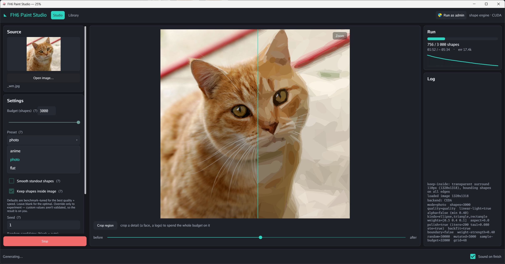

# FH6 Paint Studio

Turn any image into a **Forza Horizon vinyl livery**. FH6 Paint Studio rebuilds your photo or artwork
out of a few thousand simple coloured shapes — exactly the "layers" the in-game Vinyl Group Editor
stacks — and can inject the finished result straight into the game.

**[Download the latest release](https://github.com/HorizonRepublic/fh6-paint-studio/releases)**

See it end to end: [source photo](assets/cat/source.jpg) → [generated reconstruction](assets/cat/generated.jpg) → [on the car in-game](assets/cat/car.jpg) · also: [the Library tab](assets/cat/app-in-lib.png)

> **Requirements:** Windows + an **NVIDIA GPU with CUDA cores** — the engine is GPU-accelerated.
> AMD/Vulkan support may come later.

---

## How to use it

### 1. Get the app
Download the [latest release](https://github.com/HorizonRepublic/fh6-paint-studio/releases), unzip it
(you get **two files** — keep them in the same folder), and run **`fh6-paint-studio.exe`**.

### 2. Make a livery
1. **Open any image** you like — a photo, a logo, some art, whatever caught your eye.
   - The defaults are tuned to look good, so you can just leave everything as-is. Tweak the **preset**
     (anime / photo / flat) or the **shape budget** only if you want to.
   - For the cleanest result, use an image with a **transparent background**. A normal (opaque)
     background works too — the engine will just spend some shapes filling the background instead of
     your subject.
2. *(Optional)* **Crop** — drag a box over a region (e.g. a face) to spend the whole shape budget on
   the detail you care about.
3. Click **Generate** and wait for it to finish.
4. Your result is auto-saved to the **Library** tab.

### 3. Put it on your car (in Forza Horizon)
5. In the game's **Vinyl Group Editor**, create a group containing **N shapes** — where N is **at least
   as many shapes as your generation has** (more is fine). They can be any shapes; they're just
   placeholders the app overwrites. *Tip:* build a placeholder template once, save it, then re-import
   it and hit **Ungroup** whenever you need a fresh canvas.
6. Back in **FH6 Paint Studio → Library**, set the **FH6 layers** count, then click **Inject into FH6**.
   - If nothing happens, **run the app as administrator** (memory injection needs it — there's a
     *Run as admin* button in the app).
7. **Save the vinyl in-game — this step is required.** Right after injecting it may look rough or
   incomplete: the editor doesn't redraw every shape until the vinyl is **saved and reloaded**. Save
   it, reopen it, and it renders correctly — then apply it to your car.

### Shape budgets
Forza gives you **1000 shapes per bumper** and **3000 for every other panel** (side, roof, hood,
doors…). Match your budget to the panel you're decorating.

> Injection writes into a running game process and may violate the game's terms of service / be
> flagged by anti-cheat. It's for personal, offline use — **use it at your own risk.** Generating and
> exporting never touch the game.

---

## Roadmap

- **Bulk processing** — reconstruct a whole folder of images in one run.
- **Vulkan backend** — GPU acceleration for AMD cards (NVIDIA-only for now).

## Build from source

Needs [Go 1.26+](https://go.dev/dl/). For the CPU build, run `.\build.ps1` (Windows) or `./build.sh`
(Linux/macOS); `.\build.ps1 -Cuda` adds the GPU DLL. First-time Windows toolchain setup (Go + CUDA +
MSVC) is in `setup-windows.ps1`. Run the tests with `go test ./...`.

## License

MIT — see [LICENSE](LICENSE). © 2026 Horizon Republic.

"Forza Horizon" is a trademark of Microsoft; this is an independent, unaffiliated tool.
